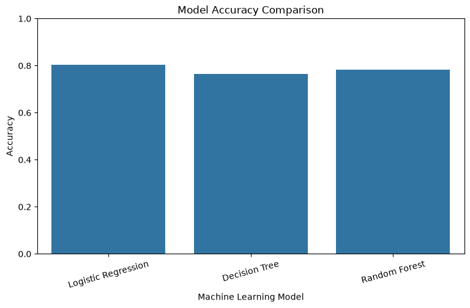
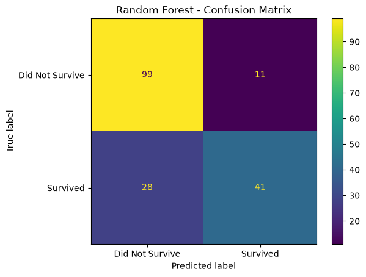
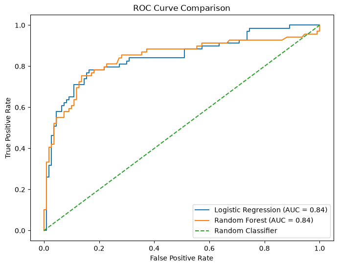
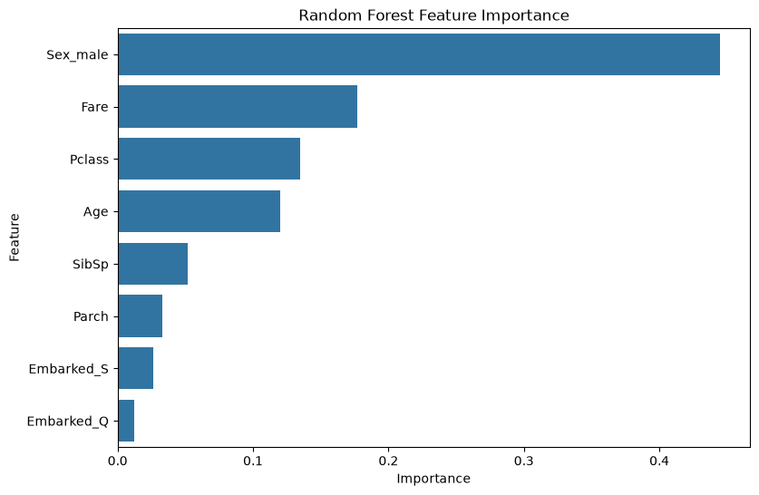

# 🤖 Predictive Modeling using Machine Learning


---

## 📌 Project Overview

This project demonstrates a complete **Machine Learning classification workflow** using the **Titanic Dataset**.

The objective is to predict whether a passenger survived based on features such as passenger class, age, gender, fare, and family-related information.

The project covers data preprocessing, feature engineering, model training, evaluation, comparison, and model saving.

---

## 🎯 Objectives

- Explore and understand the dataset
- Handle missing values
- Remove unnecessary features
- Encode categorical variables
- Split data into training and testing sets
- Apply feature scaling
- Train multiple classification models
- Evaluate model performance
- Compare different machine learning algorithms
- Identify important features
- Save the trained model

---

## 🛠️ Technologies Used

- Python
- Pandas
- NumPy
- Scikit-learn
- Matplotlib
- Seaborn
- Joblib
- Jupyter Notebook
- Git & GitHub

---

## 📊 Dataset

**Dataset:** Titanic Dataset

The Titanic dataset contains information about passengers who travelled on the Titanic.

### Target Variable

```text
Survived
```

| Value | Meaning |
|------:|---------|
| 0 | Did not survive |
| 1 | Survived |

### Features Used

- Pclass
- Age
- SibSp
- Parch
- Fare
- Sex
- Embarked

---

## 📂 Project Structure

```text
predictive-modeling-using-machine-learning/
│
├── data/
│   └── Titanic-Dataset.csv
│
├── models/
│   └── random_forest_model.pkl
│
├── notebooks/
│   └── predictive_modeling.ipynb
│
├── images/
│   ├── random_forest_confusion_matrix.png
│   ├── roc_curve_comparison.png
│   ├── feature_importance.png
│   └── model_comparison.png
│
├── outputs/
│   ├── model_comparison.csv
│   └── feature_importance.csv
│
├── README.md
├── requirements.txt
└── .gitignore
```

---

## 🔄 Machine Learning Workflow

```text
Dataset
   ↓
Exploratory Data Analysis
   ↓
Data Preprocessing
   ↓
Missing Value Handling
   ↓
Categorical Encoding
   ↓
Feature Selection
   ↓
Train-Test Split
   ↓
Feature Scaling
   ↓
Model Training
   ↓
Model Evaluation
   ↓
Model Comparison
   ↓
Best Model Selection
   ↓
Model Saving
```

---

## 🧹 Data Preprocessing

The following preprocessing techniques were applied:

- Checked missing values
- Removed unnecessary columns
- Filled missing `Age` values using the median
- Filled missing `Embarked` values using the mode
- Applied one-hot encoding to categorical variables
- Separated features and target variable
- Split the dataset into training and testing sets
- Applied StandardScaler for Logistic Regression

---

## 🤖 Machine Learning Models

Three classification algorithms were trained:

### 1. Logistic Regression

A linear classification algorithm used as a baseline model.

### 2. Decision Tree

A tree-based model that makes predictions using a series of decision rules.

### 3. Random Forest

An ensemble learning algorithm that combines multiple decision trees to improve predictive performance.

---

## 📈 Model Evaluation

The models were evaluated using:

- Accuracy
- Precision
- Recall
- F1 Score
- Confusion Matrix
- ROC Curve
- AUC

---

## 📊 Model Comparison

The performance of the trained models is stored in:

```text
outputs/model_comparison.csv
```

The comparison includes:

| Model | Accuracy | Precision | Recall | F1 Score |
|---|---:|---:|---:|---:|
| Logistic Regression | 80.45% | 79.31% | 66.67% | 72.44% |
| Decision Tree | 76.54% | 75.47% | 57.97% | 65.57% |
| Random Forest | 78.21% | 78.85% | 59.42% | 67.77% |

> ### 🏆 Best Performing Model

Based on the evaluation results, **Logistic Regression** achieved the best overall performance with an accuracy of **80.45%** and an F1 Score of **72.44%**.

Although Random Forest is an ensemble model, it did not outperform Logistic Regression on this dataset and test split.

---

## 🖼️ Visualizations

### Model Accuracy Comparison



### Random Forest Confusion Matrix



### ROC Curve Comparison



### Feature Importance



## 💾 Saved Model

The trained Random Forest model is saved using **Joblib**:

```text
models/random_forest_model.pkl
```

This allows the trained model to be reused later without retraining it.

---

## ▶️ How to Run the Project

### 1. Clone the Repository

```bash
git clone https://github.com/Jiya2304/predictive-modeling-using-machine-learning.git
```

### 2. Navigate to the Project

```bash
cd predictive-modeling-using-machine-learning
```

### 3. Install Dependencies

```bash
pip install -r requirements.txt
```

### 4. Open Jupyter Notebook

```bash
jupyter notebook
```

Open:

```text
notebooks/predictive_modeling.ipynb
```

Run the notebook cells in sequence.

---

## 📚 Learning Outcomes

Through this project, I learned:

- Supervised Machine Learning
- Classification
- Data preprocessing
- Missing value handling
- One-hot encoding
- Train-test splitting
- Feature scaling
- Model training
- Model evaluation
- Confusion matrices
- ROC-AUC analysis
- Feature importance
- Model comparison
- Saving trained ML models

---

## 🚀 Future Improvements

- Build an interactive Streamlit prediction application
- Add hyperparameter tuning using GridSearchCV
- Perform cross-validation
- Deploy the trained model
- Create a web interface for passenger survival prediction
- Experiment with additional machine learning algorithms

---

## 👩‍💻 Author

**Jiya Jain**

Artificial Intelligence & Data Science Student

GitHub:  
https://github.com/Jiya2304

---

## ⭐ Support

If you found this project useful, consider giving it a ⭐ on GitHub.